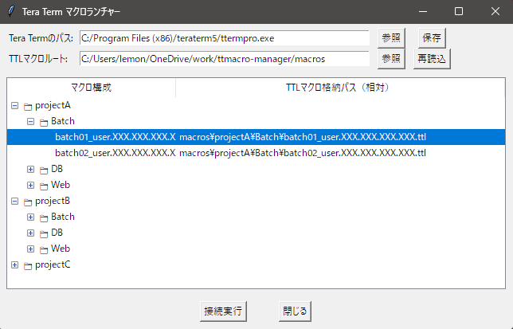

# Tera Term Macro Manager

Tera Term用の `.ttl` マクロファイルを Excelベースで一括管理・生成・起動できる環境を提供するツールです。  
複数拠点・複数アカウントの接続管理を効率化します。

---

## 特長

- 接続情報を **Excelファイル（.xlsx）で管理**
- `generate=yes` の行だけ `.ttl` マクロを自動生成
- グループ別ディレクトリに `.ttl` を出力（`macros/home/` など）
- ユーザー名・ホスト名・論理名を含めた明確なファイル名で生成
- ログ（`logs/generate.log`）で生成・エラーを一元記録
- Pythonスクリプトで **WindowsのTera Termと連携可能**
- 接続後の自動コマンド実行機能（ポストコマンド）
- メモ機能による接続情報の管理
- 鍵認証とパスワード認証の両対応
- **柔軟なパス管理**：TTLファイルの配置場所に関係なく、正しいパスでリソースにアクセス

---

## 構成イメージ

```
ttmacro-manager/
├── data/
│   ├── servers_template.xlsx   # 公開用テンプレート
│   └── servers.xlsx            # 実運用ファイル（Git管理外）
├── keys/                       # 鍵ファイル格納ディレクトリ
│   └── xxxx.key                # サーバ認証鍵（Git管理外）
├── macros/                     # .ttl 出力ディレクトリ（グループ別）（テンプレート以外はGit管理外）
│   ├── template.ttl            # ttlマクロ生成用テンプレート
│   └── [group1]/               # グループ別ディレクトリ
│       └── [group2]/
│           └── [group3]/
├── logs/
│   ├── generate.log            # ログファイル（生成・エラーを記録）（Git管理外）
│   └── XXXXX.log               # ttl実行時のログ（Git管理外）
├── bin/
│   ├── generate_ttl_macros.py  # TTLマクロ生成スクリプト
│   ├── run_launcher.py         # TTLを選んで接続
│   └── launcher_config.json    # ランチャーの設定ファイル（Git管理外）
├── requirements.txt            # ライブラリ一覧
├── .gitignore
└── README.md
```

---

## セットアップ手順（Windows）

### 1. Pythonをインストール（初回のみ）

[公式サイト](https://www.python.org/downloads/windows/)から最新版をインストール  
※ インストール時に「**Add Python to PATH**」にチェックを忘れずに！

### 2. 仮想環境（.venv）を作成

```powershell
python -m venv .venv
.venv\Scripts\activate
```

仮想環境が有効になると、プロンプトが以下のようになります：  
※もし、実行時に以下表示にならず、Pythonと表示される場合、Windowsの設定を見直す必要あり。

```
(.venv) C:\path\to\ttmacro-manager>
```

---

### 3. 必要なライブラリをインストール

インストール時にエラーが発生した場合、Visual StudioのC++デスクトップ開発環境をセットアップする必要あり。  
詳細は以下URLを参照。  
[Visual Studio に C および C++ サポートをインストールする](https://learn.microsoft.com/ja-jp/cpp/build/vscpp-step-0-installation?view=msvc-170)

```powershell
pip install -r requirements.txt
```

---

### 4. Excel台帳ファイルの準備

以下のようなExcelファイルを `data/servers.xlsx` として用意します。  
`servers_template.xlsx` をコピーして編集してください：

```powershell
copy data\servers_template.xlsx data\servers.xlsx
```

#### Excelファイルの構成（`servers.xlsx`）

| group1 | group2 | group3 | name     | host          | port | user   | password | keyfile          | post_cmd | generate | memo |
|--------|--------|--------|----------|---------------|------|--------|----------|------------------|----------|----------|------|
| LocationA | NAS    | 管理   | infra01  | 192.168.0.10  | 22   | rocky  | rocky123 |                  | date     | yes      | 本社NAS |
| LocationB |        |        | infra02  | 192.168.0.11  | 22   | rocky  |          | id_ed25519.ppk   |          | yes      | 支社サーバ |
| LocationC | 開発   | テスト | dev01    | 192.168.0.12  | 22   | dev    | devpass  |                  | ls -la   | yes      | 開発サーバ |
| LocationC | 開発   | テスト | dev02    | 192.168.0.13  | 22   | dev    | devpass  |                  | ls -la   | yes      | 開発サーバ |
|        |        |        |          |               |      |        |          |                  |          |          |      |

- `generate` 列が `yes` の行だけが `.ttl` 生成対象になります。
- `e` を検出した時点で処理終了
- 空白行はスキップされます
- `keyfile` は `keys/` ディレクトリ内のファイル名を記載してください。
- `group1` が空欄の場合は `macros/` に直下出力されます。子グループだけの指定は無効です。
- `post_cmd` は接続後に自動実行するコマンドを記載します。複数行の場合は改行で区切ります。
- `memo` は接続情報のメモを記載します。TTLファイルのヘッダーに表示されます。

#### ログファイルのフォーマット

- `generate.log`: TTLマクロ生成時のログ
  - 生成日時
  - 生成されたTTLファイル名
  - エラー情報（発生時）

  ```
  2024-03-15 14:30:22 - 生成開始
  2024-03-15 14:30:22 - ✅ infra01_rocky_192.168.0.10.ttl を生成しました。
  2024-03-15 14:30:22 - ✅ infra02_rocky_192.168.0.11.ttl を生成しました。
  2024-03-15 14:30:22 - ✅ dev01_dev_192.168.0.12.ttl を生成しました。
  2024-03-15 14:30:22 - ⏹️ 'e' を検出したため、処理を終了します。
  ```

- `XXXXX.log`: TTLマクロ実行時のログ
  - ファイル名フォーマット: `{ttl_name}_{YYYYMMDD_HHMMSS}.log`
  - 例: `infra01_rocky_192.168.0.10_20240315_143022.log`
  - 接続情報
  - 実行されたコマンド
  - コマンドの出力結果

  - ログ出力サンプル
  ```  
  [2024-03-15 14:30:22.123] [rocky@infra01 ~]$ date '+%Y/%m/%d %H:%M:%S'
  2024/03/15 14:30:23
  [2024-03-15 14:30:23.456] [rocky@infra01 ~]$ whoami
  rocky
  [2024-03-15 14:30:23.789] [rocky@infra01 ~]$ uname -a
  Linux infra01 5.15.0-91-generic #101-Ubuntu SMP Tue Nov 14 13:30:08 UTC 2023 x86_64 x86_64 x86_64 GNU/Linux
  [2024-03-15 14:30:23.890] [rocky@infra01 ~]$ date
  Fri Mar 15 14:30:23 JST 2024
  ```

---

### 5. TTLマクロを生成

```powershell
python bin/generate_ttl_macros.py
```

---

### 6. TTLを選んで起動

```powershell
python bin/run_launcher.py
```

#### ランチャーの設定（`launcher_config.json`）※自動生成

```json
{
    "teraterm_path": "C:\\Program Files\\teraterm\\ttermpro.exe",
    "macros_root": "C:\\path\\to\\ttmacro-manager\\macros"
}
```

- `teraterm_path`: Tera Termの実行ファイルのパス
- `macros_root`: TTLマクロファイルのルートディレクトリのパス

## 🖼 GUIランチャー画面イメージ

 
※イメージ画像は古い

---

## ttlマクロのパス管理の仕組み

### パス計算の仕組み

ttlマクロのパス管理は、TTLファイルとPythonの両方のコンポーネントで実装されています：

1. **TTLファイル側の処理**
   - `getdir`コマンドで現在のTTLファイルのディレクトリを取得
   - 相対パス（`rel_path`）を使用してプロジェクトルートを特定
   - ログファイル名は`{ttl_name}_{%Y%m%d_%H%M%S}.log`の形式で生成

2. **Python側の処理**
   - プロジェクトルートからの相対パスを計算
   - ログファイルの保存先を`logs/`ディレクトリに設定
   - 鍵ファイルの保存先を`keys/`ディレクトリに設定

### ログ設定の優先順位

Tera Termのログ設定は以下の優先順位で適用されます：

1. **INIファイルの設定**（最優先）
   - ユーザーのTera Term設定ファイル（`teraterm.ini`）の設定が最優先
   - ログの保存場所やファイル名のフォーマットは、INIファイルの設定が使用される
   - これにより、ユーザーごとの好みの設定を尊重

2. **TTLマクロの設定**
   - TTLファイル内の`logopen`コマンドの設定は、INIファイルの設定に上書きされる
   - ただし、INIファイルでログ設定が指定されている場合は、そちらが優先される

この仕組みにより：
- ユーザーは各自の環境に合わせてログ設定をカスタマイズ可能
- プロジェクト全体での一貫したログ管理が可能
- セキュリティを考慮したログファイルの配置が実現

---

## トラブルシューティング

### よくある問題と解決方法

1. **TTLファイルが見つからない**
   - 確認事項：
     - `macros_root`の設定が正しいか
     - TTLファイルが正しいディレクトリに生成されているか
   - 解決方法：
     - `launcher_config.json`の`macros_root`を確認
     - `generate_ttl_macros.py`を再実行

2. **鍵ファイルが見つからない**
   - 確認事項：
     - `keys/`ディレクトリに鍵ファイルが存在するか
     - Excelファイルの`keyfile`列の値が正しいか
   - 解決方法：
     - 鍵ファイルを`keys/`ディレクトリに配置
     - Excelファイルの`keyfile`列を確認

3. **ログファイルが生成されない**
   - 確認事項：
     - `logs/`ディレクトリが存在するか
     - 書き込み権限があるか
   - 解決方法：
     - `logs/`ディレクトリを手動で作成
     - ディレクトリの権限を確認

4. **パス解決エラー**
   - 確認事項：
     - TTLファイルの配置場所が正しいか
     - グループ階層が正しく設定されているか
   - 解決方法：
     - TTLファイルを正しいディレクトリに移動
     - Excelファイルのグループ設定を確認

5. **Pythonの実行エラー**
   - 確認事項：
     - 仮想環境（.venv）が有効になっているか
     - 必要なライブラリがインストールされているか
   - 解決方法：
     - `.venv\Scripts\activate`を実行
     - `pip install -r requirements.txt`を実行

6. **Excelファイルの読み込みエラー**
   - 確認事項：
     - Excelファイルが他のアプリケーションで開かれていないか
     - ファイルの形式が正しいか（.xlsx）
   - 解決方法：
     - Excelファイルを閉じる
     - ファイルを.xlsx形式で保存し直す

## セキュリティに関する注意事項

1. **パスワード管理**
   - Excelファイル（`servers.xlsx`）に平文でパスワードを保存しない
   - 可能な限り鍵認証を使用
   - パスワードを使用する場合は、ファイルのアクセス権限を適切に設定

2. **鍵ファイルの管理**
   - `keys/`ディレクトリのアクセス権限を適切に設定
   - 秘密鍵のパーミッションを適切に設定（Windowsの場合：所有者のみアクセス可能）
   - 鍵ファイルをGitで管理しない（`.gitignore`に設定済み）

3. **ログファイルの管理**
   - ログファイルには機密情報が含まれる可能性がある
   - 定期的なログローテーションを検討
   - 不要なログファイルは適切に削除

4. **TTLファイルの管理**
   - 生成されたTTLファイルには接続情報が含まれる
   - 不要なTTLファイルは適切に削除
   - ファイルのアクセス権限を適切に設定

---

## 今後の展望

- exeファイル化し、python不要での実行
- コメントや用途別テンプレートの自動適用
- グループ変更時の旧ファイル削除機能
- パスワード暗号化
- 複数template.ttlの活用
- マクロのバージョン管理  
　- 変更履歴の追跡  
　- 以前のバージョンへの戻し  
- UI/UXの改善
- パス管理のさらなる改善
  - 環境変数によるパス設定
  - カスタムパス設定のサポート
  - パス解決のキャッシュ機能

