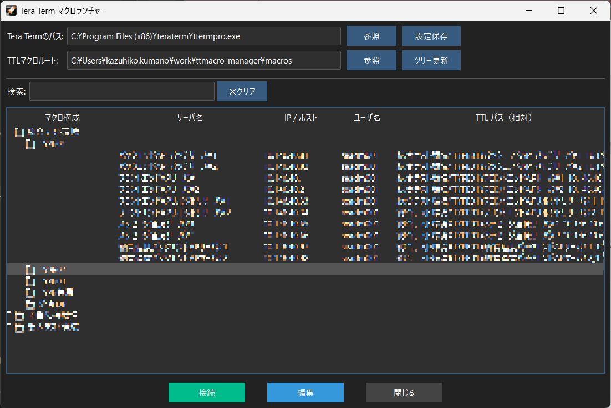

# Tera Term Macro Manager

Tera Term用の `.ttl` マクロファイルを Excelベースで一括管理・生成・起動できる環境を提供するツールです。  
複数拠点・複数アカウントの接続管理を効率化します。

---

## 特長

- 接続情報を **Excelファイル（.xlsx）で管理**
- `generate=yes` の行だけ `.ttl` マクロを自動生成
- グループ別ディレクトリに `.ttl` を出力（`macros/home/` など）
- ファイル名は **論理名_IPアドレス_ユーザ名** で生成（例: `infra01_192.168.0.10_rocky.ttl`）
- 生成ログは `logs/generate.log`、TTL実行時のログは `logs/` 直下に出力
- Windows の Tera Term（`ttermpro.exe`）を `/M=<ttl>` 引数で起動
- **用途別テンプレート**: Excelの `template` 列で行ごとに切り替え可能（空欄は `default.ttl`）
- **--clean オプション**: グループ変更で残った旧 TTL を一括掃除（`--dry-run` で削除候補確認）
- **環境変数によるパス上書き**: `TTMACRO_*` で BASE_DIR / EXCEL_PATH 等を個別に変更可能
- **GUI ランチャー（ttkbootstrap ダークテーマ）**: 検索ボックス・ツリー表示・接続/編集ボタン
- **PyInstaller による exe 配布**: Python 未導入環境でも単体 exe で動作
- 接続後の自動コマンド実行機能（ポストコマンド）
- メモ機能による接続情報の管理
- 鍵認証とパスワード認証の両対応
- **柔軟なパス管理**：TTLファイルの配置場所に関係なく、正しいパスでリソースにアクセス

---

## 構成イメージ

```text
ttmacro-manager/
├── data/
│   ├── servers_template.xlsx   # 公開用テンプレート
│   └── servers.xlsx            # 実運用ファイル（Git管理外）
├── keys/                       # 鍵ファイル格納ディレクトリ
│   └── xxxx.key                # サーバ認証鍵（Git管理外）
├── macros/                     # .ttl 出力ディレクトリ（グループ別）（テンプレート以外はGit管理外）
│   ├── templates/
│   │   ├── default.ttl         # デフォルトテンプレート（template列が空の行で使用）
│   │   └── *.ttl               # 用途別テンプレート（任意）
│   └── [group1]/               # グループ別ディレクトリ
│       └── [group2]/
│           └── [group3]/
├── logs/
│   ├── generate.log            # 生成スクリプトのログ（Git管理外）
│   └── XXXXX.log               # ttl実行時のログ（Git管理外）
├── src/
│   └── ttmacro/                # 生成器・ランチャーの本体パッケージ
│       ├── config.py           # パス定数（TTMACRO_* 環境変数で上書き可）
│       ├── logger.py           # ログ設定
│       ├── path_resolver.py    # 出力先・相対パス計算
│       ├── ttl_renderer.py     # テンプレート展開
│       ├── excel_loader.py     # Excel I/O・行検証（openpyxl 直叩き）
│       ├── cleaner.py          # --clean 時の旧 TTL 削除
│       ├── cli.py              # ttmacro-generate のエントリ
│       └── launcher.py         # ttmacro-launcher のエントリ（GUI）
├── tests/                      # pytest テスト（100 件）
│   ├── test_cleaner.py
│   ├── test_config.py
│   ├── test_excel_loader.py
│   ├── test_path_resolver.py
│   └── test_ttl_renderer.py
├── packaging/                  # PyInstaller 用資材
│   ├── entry_generate.py       # CLI 用エントリスクリプト
│   ├── entry_launcher.py       # GUI 用エントリスクリプト
│   ├── ttmacro-generate.spec   # CLI 用 .spec
│   ├── ttmacro-launcher.spec   # GUI 用 .spec
│   └── launcher.ico            # exe・ウィンドウ用アイコン
├── bin/
│   ├── ttmacro-generate.exe    # PyInstaller 成果物（任意。Git管理外）
│   ├── ttmacro-launcher.exe    # PyInstaller 成果物（任意。Git管理外）
│   └── launcher_config.json    # ランチャーの設定ファイル（Git管理外）
├── build.ps1                   # exe ビルド + zip 化を自動化するスクリプト
├── pyproject.toml              # 依存・ツール設定（hatchling / ruff / pytest / mypy / pyinstaller）
├── .gitignore
└── README.md
```

---

## セットアップ手順（Windows）

### 1. Pythonをインストール（初回のみ）

[公式サイト](https://www.python.org/downloads/windows/)から最新版をインストール  
※ インストール時に「**Add Python to PATH**」にチェックを忘れずに！

### 2. 仮想環境（.venv）の利用

**初回のみ** — 仮想環境を作成してから有効化：

```powershell
# Python 3.12 以上で作成（複数バージョンがある場合は py -3.12 -m venv .venv のように明示指定）
python -m venv .venv
.venv\Scripts\Activate
```

**2回目以降** — 仮想環境を有効にするだけ：

```powershell
.venv\Scripts\Activate
```

仮想環境が有効になると、プロンプトの先頭に `(.venv)` が付きます。  
表示されない場合は、Windowsの設定（実行ポリシー等）を確認してください。

```text
(.venv) C:\path\to\ttmacro-manager>
```

---

### 3. プロジェクトをインストール

依存・開発ツール設定は [pyproject.toml](pyproject.toml) で一元管理されています。  
プロジェクトを編集可能な形で `pip install` してください：

```powershell
# 開発ツール込み（ruff / pytest / mypy / pyinstaller などが入る。通常はこちらを推奨）
pip install -e ".[dev]"

# 本番動作のみ（openpyxl / ttkbootstrap のみ）
pip install -e .
```

インストール後、`ttmacro-generate` と `ttmacro-launcher` の 2 つのコマンドが PATH に追加されます。

依存ライブラリ（openpyxl / ttkbootstrap / pyinstaller など）はすべて純 Python 実装なので、Visual Studio などのビルドツールは不要です。

---

### 4. Excel台帳ファイルの準備

以下のようなExcelファイルを `data/servers.xlsx` として用意します。  
`servers_template.xlsx` をコピーして編集してください：

```powershell
copy data\servers_template.xlsx data\servers.xlsx
```

#### Excelファイルの構成（`servers.xlsx`）

| group1    | group2 | group3 | name    | host         | port | user  | password | keyfile        | post_cmd | generate | template | memo       |
|-----------|--------|--------|---------|--------------|------|-------|----------|----------------|----------|----------|----------|------------|
| LocationA | NAS    | 管理   | infra01 | 192.168.0.10 | 22   | rocky | rocky123 |                | date     | yes      |          | 本社NAS    |
| LocationB |        |        | infra02 | 192.168.0.11 | 22   | rocky |          | id_ed25519.ppk |          | yes      |          | 支社サーバ |
| LocationC | 開発   | テスト | dev01   | 192.168.0.12 | 22   | dev   | devpass  |                | ls -la   | yes      | nodejs   | 開発サーバ |
| LocationC | 開発   | テスト | dev02   | 192.168.0.13 | 22   | dev   | devpass  |                | ls -la   | yes      | nodejs   | 開発サーバ |
|           |        |        |         |              |      |       |          |                |          |          |          |            |

- `generate` 列が `yes` の行だけが `.ttl` 生成対象になります。
- `e` を検出した時点で処理終了
- 空白行はスキップされます
- `keyfile` は `keys/` ディレクトリ内のファイル名を記載してください。
- `group1` が空欄の場合は `macros/` に直下出力されます。子グループだけの指定は無効です。
- `post_cmd` は接続後に自動実行するコマンドを記載します。複数行の場合は改行で区切ります。
- `template` は使用するテンプレート名（拡張子省略可）。空欄なら `default.ttl`、`nodejs` と書けば `macros/templates/nodejs.ttl` を使う。
- `memo` は接続情報のメモを記載します。TTLファイルのヘッダーに表示されます。

#### ログファイルのフォーマット

- `generate.log`: TTLマクロ生成時のログ
  - 生成日時
  - 生成されたTTLファイル名
  - エラー情報（発生時）

  ```text
  2024-03-15 14:30:22 - 生成開始
  2024-03-15 14:30:22 - ✅ infra01_192.168.0.10_rocky.ttl を生成しました。
  2024-03-15 14:30:22 - ✅ infra02_192.168.0.11_rocky.ttl を生成しました。
  2024-03-15 14:30:22 - ✅ dev01_192.168.0.12_dev.ttl を生成しました。
  2024-03-15 14:30:22 - ⏹️ 'e' を検出したため、処理を終了します。
  ```

- `XXXXX.log`: TTLマクロ実行時のログ（`logs/` 直下に出力）
  - ファイル名フォーマット: `{論理名}_{IP}_{ユーザ名}_{YYYYMMDD_HHMMSS}.log`
  - 例: `logs/infra01_192.168.0.10_rocky_20240315_143022.log`
  - 接続情報
  - 実行されたコマンド
  - コマンドの出力結果

  - ログ出力サンプル

  ```text
  [2024-03-15 14:30:22.123] [rocky@infra01 ~]$ date '+%Y/%m/%d %H:%M:%S'
  2024/03/15 14:30:23
  [2024-03-15 14:30:23.456] [rocky@infra01 ~]$ whoami
  rocky
  [2024-03-15 14:30:23.789] [rocky@infra01 ~]$ uname -a
  Linux infra01 5.15.0-91-generic #101-Ubuntu SMP Tue Nov 14 13:30:08 UTC 2023 x86_64 x86_64 x86_64 GNU/Linux
  [2024-03-15 14:30:23.890] [rocky@infra01 ~]$ date
  Fri Mar 15 14:30:23 JST 2024
  ```

---

### 5. TTLマクロを生成

```powershell
# 全行を生成（generate=yes の行のみ対象）
ttmacro-generate

# 特定の No. のみ生成（generate 列の値に関係なく対象行を処理）
ttmacro-generate --row 5

# 既存 TTL を全削除してから生成（グループ変更で残った旧 TTL の掃除）
ttmacro-generate --clean

# 削除対象を確認するだけ（実削除も生成もしない）
ttmacro-generate --clean --dry-run
```

`template` 列に値を入れた行は `macros/templates/<その値>.ttl` を、空欄の行は `default.ttl` を使って生成されます。

---

### 6. TTLを選んで起動

```powershell
ttmacro-launcher
```

#### ランチャーの設定（`launcher_config.json`）※自動生成

```json
{
    "teraterm_path": "C:\\Program Files\\teraterm\\ttermpro.exe",
    "macros_root": "C:\\path\\to\\ttmacro-manager\\macros"
}
```

- `teraterm_path`: Tera Termの実行ファイルのパス
- `macros_root`: TTLマクロファイルのルートディレクトリのパス

## 🖼 GUIランチャー画面イメージ



ttkbootstrap の `darkly` テーマでダークモード化され、検索ボックス・サーバ名/IP/ユーザ名の 3 列表示・接続/編集/閉じるボタンを備える。

## ttlマクロのパス管理の仕組み

### パス計算の仕組み

ttlマクロのパス管理は、TTLファイルとPythonの両方のコンポーネントで実装されています：

1. **TTLファイル側の処理**
   - `getdir`コマンドで現在のTTLファイルのディレクトリを取得
   - 相対パス（`rel_path`）を使用してプロジェクトルートを特定
   - ログファイル名は`{論理名}_{IP}_{ユーザ名}_{%Y%m%d_%H%M%S}.log`の形式で生成

2. **Python側の処理**
   - プロジェクトルートからの相対パスを計算
   - ログの保存先を `logs/` ディレクトリ直下に設定
   - 鍵ファイルの保存先を`keys/`ディレクトリに設定

### ログ設定の優先順位

Tera Termのログ設定は以下の優先順位で適用されます：

1. **INIファイルの設定**（最優先）
   - ユーザーのTera Term設定ファイル（`teraterm.ini`）の設定が最優先
   - ログの保存場所やファイル名のフォーマットは、INIファイルの設定が使用される
   - これにより、ユーザーごとの好みの設定を尊重

2. **TTLマクロの設定**
   - TTLファイル内の`logopen`コマンドの設定は、INIファイルの設定に上書きされる
   - ただし、INIファイルでログ設定が指定されている場合は、そちらが優先される

この仕組みにより：

- ユーザーは各自の環境に合わせてログ設定をカスタマイズ可能
- プロジェクト全体での一貫したログ管理が可能
- セキュリティを考慮したログファイルの配置が実現

---

## トラブルシューティング

### よくある問題と解決方法

1. **TTLファイルが見つからない**
   - 確認事項：
     - `macros_root`の設定が正しいか
     - TTLファイルが正しいディレクトリに生成されているか
   - 解決方法：
     - `launcher_config.json`の`macros_root`を確認
     - `ttmacro-generate` を再実行

2. **鍵ファイルが見つからない**
   - 確認事項：
     - `keys/`ディレクトリに鍵ファイルが存在するか
     - Excelファイルの`keyfile`列の値が正しいか
   - 解決方法：
     - 鍵ファイルを`keys/`ディレクトリに配置
     - Excelファイルの`keyfile`列を確認

3. **ログファイルが生成されない**
   - 確認事項：
     - `logs/` ディレクトリが存在するか
     - 書き込み権限があるか
   - 解決方法：
     - `logs/` ディレクトリを手動で作成するか、生成スクリプト実行時に自動作成されることを確認
     - ディレクトリの権限を確認

4. **パス解決エラー**
   - 確認事項：
     - TTLファイルの配置場所が正しいか
     - グループ階層が正しく設定されているか
   - 解決方法：
     - TTLファイルを正しいディレクトリに移動
     - Excelファイルのグループ設定を確認

5. **Pythonの実行エラー / コマンドが見つからない**
   - 確認事項：
     - 仮想環境（.venv）が有効になっているか
     - 必要なライブラリがインストールされているか
     - `ttmacro-generate` / `ttmacro-launcher` コマンドが PATH に通っているか
   - 解決方法：
     - `.venv\Scripts\activate`を実行
     - `pip install -e ".[dev]"` を実行（インストール時に console scripts が登録される）
     - 仮想環境を Activate しない場合は `.venv\Scripts\ttmacro-generate` のように直接呼ぶ

6. **Excelファイルの読み込みエラー**
   - 確認事項：
     - Excelファイルが他のアプリケーションで開かれていないか
     - ファイルの形式が正しいか（.xlsx）
   - 解決方法：
     - Excelファイルを閉じる
     - ファイルを.xlsx形式で保存し直す

## セキュリティに関する注意事項

1. **パスワード管理**
   - Excelファイル（`servers.xlsx`）に平文でパスワードを保存しない
   - 可能な限り鍵認証を使用
   - パスワードを使用する場合は、ファイルのアクセス権限を適切に設定

2. **鍵ファイルの管理**
   - `keys/`ディレクトリのアクセス権限を適切に設定
   - 秘密鍵のパーミッションを適切に設定（Windowsの場合：所有者のみアクセス可能）
   - 鍵ファイルをGitで管理しない（`.gitignore`に設定済み）

3. **ログファイルの管理**
   - ログファイルには機密情報が含まれる可能性がある
   - 定期的なログローテーションを検討
   - 不要なログファイルは適切に削除

4. **TTLファイルの管理**
   - 生成されたTTLファイルには接続情報が含まれる
   - 不要なTTLファイルは適切に削除
   - ファイルのアクセス権限を適切に設定

---

## exe 配布版のビルド（Python 不要環境向け）

PyInstaller で `bin/*.exe` を生成して、Python が入っていない端末にも配布できます。

### おすすめ: build.ps1 でまとめて作成

プロジェクトルートで以下を実行するだけで、exe ビルド → 配布フォルダ組み立て → zip 化まで自動化されます。

```powershell
.\build.ps1
```

成果物:

- `bin/ttmacro-launcher.exe`（約 20 MB）
- `bin/ttmacro-generate.exe`（約 16 MB）
- `deploy/`（配布用フォルダ。`bin/` `data/` `macros/templates/` `keys/` `logs/` を含む）
- `ttmacro-manager-v<version>.zip`（`deploy/` を圧縮したもの。配布相手に渡す）

配布相手は zip を解凍 → `data/servers_template.xlsx` を `servers.xlsx` にリネーム + 編集 → `bin/ttmacro-launcher.exe` を起動、で使い始められます。

### 個別にビルドしたい場合

```powershell
# GUI ランチャー
.venv\Scripts\pyinstaller --clean --distpath bin packaging/ttmacro-launcher.spec

# TTL 生成 CLI
.venv\Scripts\pyinstaller --clean --distpath bin packaging/ttmacro-generate.spec
```

exe は `<deploy_root>/bin/` 配下に置く前提で、`data/` `macros/` 等を相対参照します。`bin/` 単体で別フォルダに移動すると動かないので注意してください。

---

## 今後の展望

- パスワード暗号化（Tera Term の `/passwd=` が平文要求のため、根本的には鍵認証推奨）
- マクロのバージョン管理（変更履歴の追跡 / 以前のバージョンへの戻し）
- UI/UXのさらなる改善
